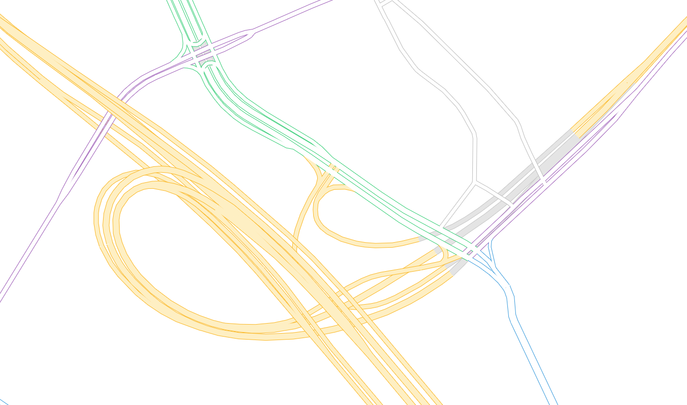

# single-highway-layer
A map which uses a single highway layer.

Live demo: https://wipfli.github.io/single-highway-layer

<a href="https://wipfli.github.io/single-highway-layer/#map=16.15/42.371101/-71.065057"></a>

<i>Screenshot of a complex highway network in <a href="https://wipfli.github.io/single-highway-layer/#map=16.15/42.371101/-71.065057">Boston</a> which has bridges, tunnels, and highways of different categories.</i>

# Story

## The traditional way

Traditionally, when people make vector maps with a frontend rendering library like <a href="https://github.com/maplibre/maplibre-gl-js">MapLibre GL JS</a>, they use vector tiles containing the data and add styling in the frontend. To make a map of a highway network, the vector tiles contain information about the highway geometries and classification. To render the highway geometries, people typically use multiple layers in the MapLibre style sheet where they define a highway's color, line width, and order in which it gets drawn.

The order in which highway lines are drawn on a map should respect the physical reality, for example bridges should show up on top of normal roads on the ground, and tunnels should be below. If a bridge crosses another bridge, the top most bridge should be the one visible on the map. Realizing correct ordering is somewhat painful in the traditional approach where people use multiple layers in MapLibre GL JS for different highway categories like motorway, trunk, primary, etc. and for the different vertical places at which the highway might be like tunnel, bridge, and multiple layers of the two.

To make an example on the number of traditional layers required for a simple map: Say we want to render 6 categories of highways (motorway, trunk, primary, secondary, tertiary, unclassified) and we want to get bridges and tunnels right, we are already at 6 * 3 = 18 layers. Of course we also like to add casing to our highway lines, resulting in another factor of 2, i.e., a total of 36 layers in MapLibre GL JS to render a very basic highway network. If people want to add more details and specialization, the number of layers quickly can get into the hundreds...

## New possibilities

Tile generation was expensive in the past which probably motivated people to make vector tiles once and then do all the styling in the frontend. But today with <a href="https://github.com/onthegomap/planetiler">Planetiler</a>, it is actually super simple and cheap to make vector tiles for a specific use-case and styling. So why don't we put the styling information just into the vector tiles?

The solution proposed here bundles the highway style information like line width, color, and ordering, into a single highway layer in the vector tiles, see the <a href="https://github.com/wipfli/single-highway-layer/blob/main/src/main/java/com/onthegomap/planetiler/examples/SingleHighwayLayer.java">SingleHighwayLayer.java</a> Planetiler profile.

The rendering logic looks similar to this block:

```java
features.line("highway")
    .setMinPixelSize(0)
    .setMinZoom(minZoom)
    .setMaxZoom(maxZoom)
    .setAttr("line-sort-key", new LineSortKey(categoryIndex, isLink, isBridge, isTunnel, layer, false))
    .setAttr("line-color", new LineColor(isTunnel, false, lineColorLevels))
    .setAttr("line-width", new LineWidth(false, isLink, lineWidthLevels))
    .setAttr("line-width-z20", 5 * (lineWidthLevels[14] - (isLink ? 1.5 : 0)));
```

Where `LineSortKey`, `LineColor`, and `LineWidth` are zoom-dependent functions.

The frontend MapLibre GL JS <a href="https://github.com/wipfli/single-highway-layer/blob/main/style.json">style.json</a> file gets really simple. It consists of a single layer which just picks up the values from the tiles.

```json
{
    "id": "highway",
    "type": "line",
    "source": "single-highway-layer",
    "source-layer": "highway",
    "layout": {
        "line-cap": "butt",
        "line-join": "round",
        "visibility": "visible",
        "line-sort-key": ["to-number", ["get", "line-sort-key"]]
    },
    "paint": {
        "line-color": ["get", "line-color"],
        "line-width": [
            "interpolate",
            ["linear"],
            ["zoom"],
            14,
            ["to-number", ["get", "line-width"]],
            20,
            ["to-number", ["get", "line-width-z20"]]
        ]
    }
}
```

Correct ordering is ensured by the `line-sort-key` layout property.

## Advantages

* Reduced number of layers in the frontend
* Freedom to change ordering depending on zoom level

Changing the ordering depending on the zoom level is particularly useful for making important highways visually more continuous at low zoom levels. In the example here, bridges are only rendered on top of ground highways at z14 and higher. This can be nicely seen at https://wipfli.github.io/single-highway-layer/#map=17.6/42.347676/-71.092282, where at high zoom levels the green bridge is above the yellow highway, whereas below z14, it appears below.

## Disadvantages

* Changing the styling requires regenerating the tiles
* MapLibre GL JS does not support data-driven styling of dashed lines
* MapLibre GL JS does not have `*-casing` line properties, resulting in one line in the tiles for the casing and one for the fill
* Tiles might be larger because they contain styling information

MapLibre GL JS can be modified to support the above missing features. The tile size increase due to the extra styling properties is probably not significantly larger because one would guess that tile size is dominated by geometric information. And regenerating tiles to change styling is not really a problem now that we have Planetiler. A lot of people just want a base map and they are not interested in tuning the width and colors of roads...

## Feedback

If you have any feedback to the approach proposed here, feel free to open an <a href="https://github.com/wipfli/single-highway-layer/issues">Issue</a>.

# Usage

To build the tiles yourself, do the following (instructions for Ubuntu Linux):

## Requirements
### Planetiler

Install java 17 for Planetiler, see https://adoptium.net/installation/linux/

### PMTiles

Get the `pmtiles` binary executable tool from https://github.com/protomaps/go-pmtiles/releases

### Http Server

Install a http server supporting range requests. We use `npx serve .` in this example. Requires <a href="https://www.digitalocean.com/community/tutorials/how-to-install-node-js-on-ubuntu-20-04">nodejs</a>, and <a href="https://www.npmjs.com/package/npx">npx</a>.

## Build locally

Clone this repository with:

```
git clone https://github.com/wipfli/single-highway-layer.git && cd single-highway-layer
```

Build the Planetiler profile with:

```
./mvnw clean package --file standalone.pom.xml
```

Generate the tiles for the GeoFabrik area Massachusetts with:
```
java -cp target/*-with-deps.jar com.onthegomap.planetiler.examples.SingleHighwayLayer --download --area=massachusetts
```

Convert the mbtiles to pmtiles with:

```
pmtiles convert data/single-highway-layer.mbtiles data/single-highway-layer.pmtiles
```

Serve the files locally with:

```
npx serve .
```

Alternatively, you can run all the above steps with the script `local-build.sh`:
```
./local-build.sh
```

To view the map, open a web browerser and go to http://localhost:3000

